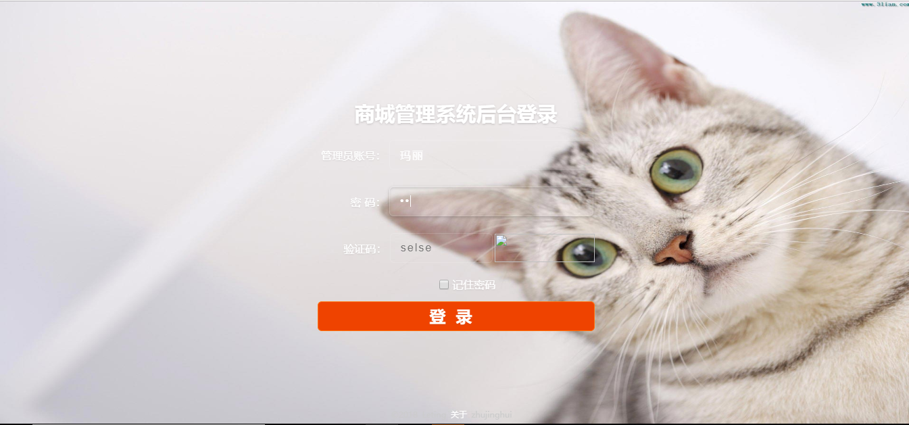
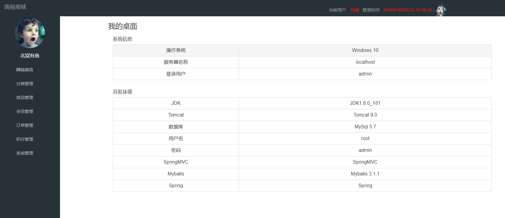
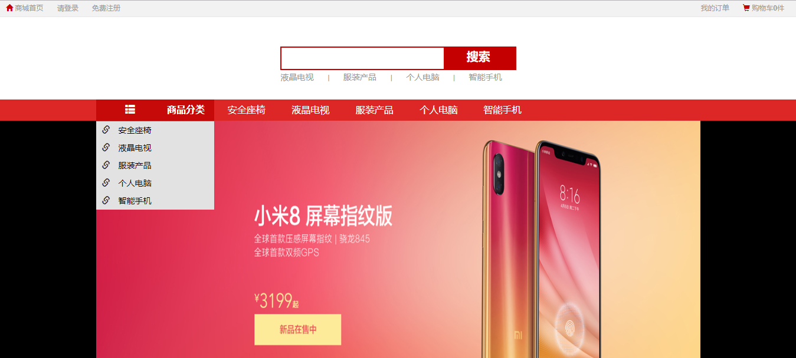

# Study_ssm
这是一个基于ssm的商城学习项目

项目简介： SSM搭建简单商城

后台登录url:    http://localhost:8080/admin/adminLogin
商城首页url:    http://localhost:8080/fore/foreHome

   

        前端使用：  Html, CSS, JS, BootStrap, AJAX, JQUERY
        框架：      Spring, Spring MVC, Mybatis   
        数据库：    MySQL   
        开发工具：  IDEA, Maven

​            

后台登录

后台首页

商城首页

单个商品

